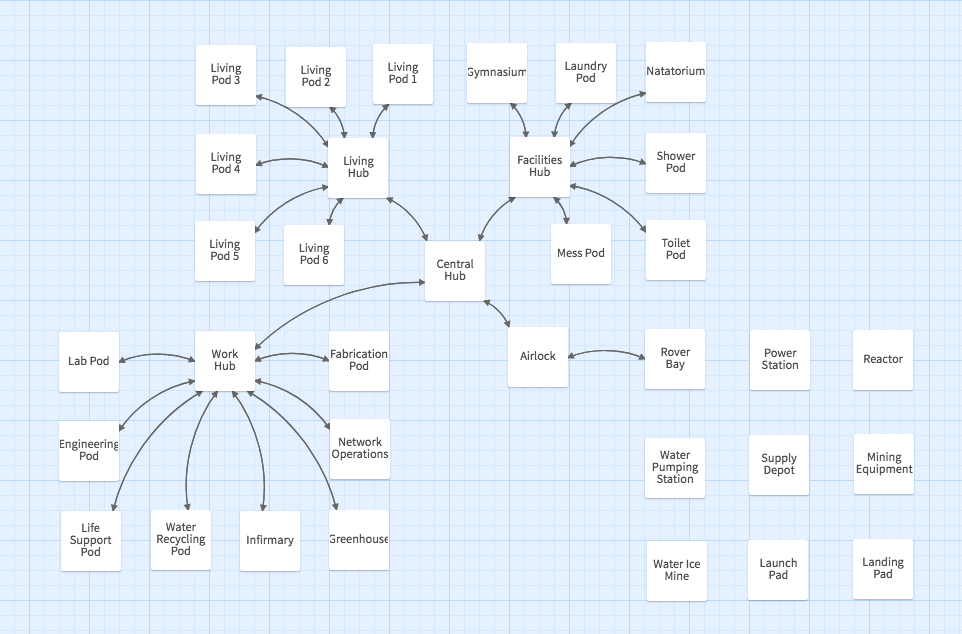

# mars-colony
Run a colony on the Red Planet. A Twine game.



## STATUS
**Work in Progress** - All locations on map exist and you can navigate between them via links. There are no descriptions or logic yet.

## DEVELOPER SETUP
### Prerequisites
* [Node](https://nodejs.org/en/download/) v12.6.0 or above (also installs npm)
* [Tweego](https://www.motoslave.net/tweego/) v2.0.0 or above

#### If Installing Tweego on Windows
* Here is [a handy project](https://github.com/ChapelR/tweego-installer) that may help. Good luck and godspeed.

#### If Installing Tweego on Mac or Linux
* Unzip distribution file in your home directory
* Create a symbolic link to the executable: ```ln -s ~/tweego-2.0.0-macos-x86/tweego /usr/local/bin/tweego```
* Create a symbolic link to the storyformats: ```ln -s ~/tweego-2.0.0-macos-x86/storyformats ~/.storyformats```

### Download the project
* [Download the project](https://github.com/cliffhall/mars-colony/archive/master.zip) as a ```.zip``` file and unzip wherever you keep your projects.
* OR if you have ```git``` installed on your system:
```
cd path/to/your/projects
git clone https://github.com/cliffhall/mars-colony.git
```

### Install dependencies
```
cd path/to/mars-colony
npm install
```

### Build the entire project once
```
npm run build-once
```

### Test the output
Open ```dist/index.html``` in your browser of choice

## CONTINUOUS DEVELOPMENT
To work on JS, CSS, and TWEE sources and have them continuously compiled as you make changes, you need to open two dedicated terminal windows and run:
```
npm run watch:gulp
```

and

``` 
npm run watch:twee
```

## Project structure and build process
You might want to fiddle with the source code of this game, contribute to it, or use its skeleton as a basis for your own project. So, it's worth describing how things work and where things go here.

The structure and build process were  inspired by and based upon [tweego-setup](https://github.com/ChapelR/tweego-setup) by Chapel.

That said, a *lot* of changes have been made.
* It does not have batch files for windows (the above project can help with that).
* Folders have been moved around, renamed, or removed altogether in the interest of streamlining and clarity.
* Configuration of gulp (previously ```config.json```) has been moved inside ```gulpfile.js```. Since it wasn't being used for anything else, there was no need to arbitrarily separate the two. 
* Support is added to start gulp and tweego in watch mode, so you can just edit your ```.css```, ```.js```, and ```.twee``` files at will and it will automagically recompile everytime you save.

#### Ok, so where does stuff go?
* Media files that the project references (images, videos, sounds) should be placed directly into the ```dist/assets``` folder, as they are not handled at any stage in the build process.
* Custom JavaScript and CSS goes in the ```src/app``` folder.
* Third party JavaScript and CSS goes in the ```src/vendor``` folder. 
* Custom fonts go in the ```project/modules``` folder and will end up being placed in the output file as raw data rather than files to be loaded.
* Finally, Twee source files go in the ```project/twee``` folder.

### How and what does this thing build?
It is a two-step build whose final output lands in ```dist/index.html```, which then is hopefully a playable [Twine](https://twinery.org/) game.

#### 1. Bundle vendor and app-specific JS.
This is achieved with ```gulp``` as configured in ```gulpfile.js```. All of the ```.css``` and ```.js``` files found in ```src/app``` are transpiled from ES6 to ES5 and minified to ```/project/modules/app.min.css``` and ```project/modules/app.min.js```. Similarly, any third party ```.css``` and ```.js``` files found in ```src/vendor``` are processed and placed in ```/project/modules/vendor.min.css``` and ```project/modules/vendor.min.js```.

#### 2. Compile twee source and bundled styles and scripts from step 1.
This is achieved with ```tweego``` as scripted in ```package.json``` in the ```scripts``` section. It compiles your ```.twee``` source code in ```project/twee``` and picks up any fonts you may have placed in the ```project/modules``` folder as well as minified app or vendor CSS/JS that has been left there by step 1. All this stuff -- fonts, transpiled/minified JS & CSS, and compiled TWEE -- are then baked into a single output file at ```dist/index.html```.


