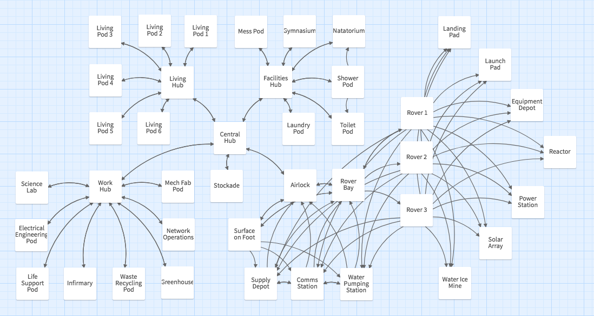

# mars-colony
Run a colony on the Red Planet. A Twine game.



## STATUS
**Work in Progress** - All locations on map exist and you can navigate between them via links. There are no descriptions or logic yet.

## DEVELOPER SETUP
### Prerequisites
* [Node](https://nodejs.org/en/download/) v12.6.0 or above (also installs npm)
* [Tweego](https://www.motoslave.net/tweego/) v2.0.0 or above

#### If Installing Tweego on Windows
* Here is [a handy project](https://github.com/ChapelR/tweego-installer) that may help. Good luck and godspeed.

#### If Installing Tweego on Mac or Linux
* Unzip distribution file in your home directory
* Create a symbolic link to the executable: ```ln -s ~/tweego-2.0.0-macos-x86/tweego /usr/local/bin/tweego```
* Create a symbolic link to the storyformats: ```ln -s ~/tweego-2.0.0-macos-x86/storyformats ~/.storyformats```

### Download the project
* [Download the project](https://github.com/cliffhall/mars-colony/archive/master.zip) as a ```.zip``` file and unzip wherever you keep your projects.
* OR if you have ```git``` installed on your system:
```
cd path/to/your/projects
git clone https://github.com/cliffhall/mars-colony.git
```

### Install dependencies
```
cd path/to/mars-colony
npm install
```

### Build the entire project once
```
npm run build-once
```

### Test the output
Open ```dist/index.html``` in your browser of choice

## CONTINUOUS DEVELOPMENT
To work on JS, CSS, and TWEE sources and have them continuously compiled as you make changes, you need to open two dedicated terminal windows and run:
```
npm run watch:gulp
```

and

``` 
npm run watch:twee
```

## Project structure and build process
The skeleton for this project is called [slim-tweego](https://github.com/cliffhall/slim-tweego). For more information about how it works or to start your own tweego project, go there.
